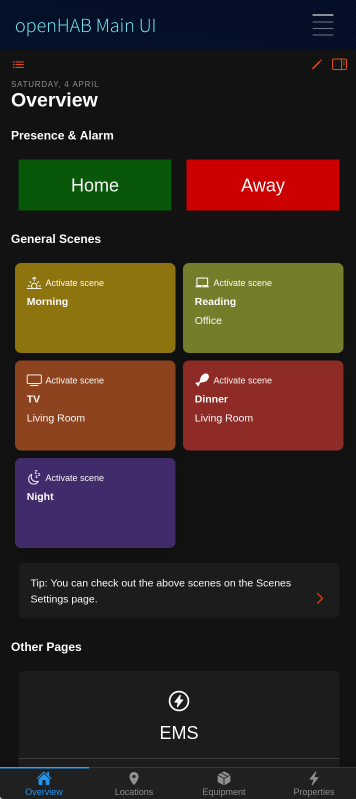
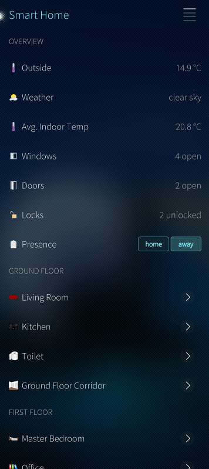
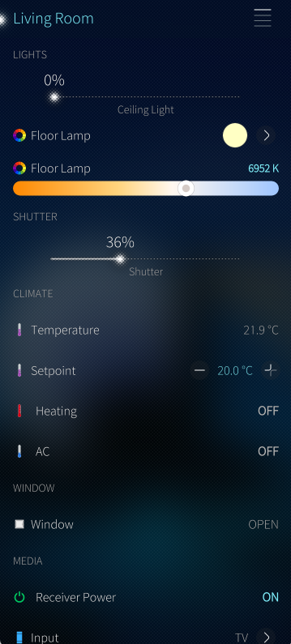

<!-- markdownlint-disable MD041 -->

    
        
     
    
     
    <b>openHAB client for Sailfish OS</b>

## Introduction

This app is a native client for openHAB which allows easy access to your sitemaps.
The documentation is available at [www.openhab.org/docs/](https://www.openhab.org/docs/).

## Features

- Demo Mode: Explore the app without connecting to an openHAB server
- Local authentication supported - if enabled on openHAB server.
- Display your Main UI Webview
- Display your sitemaps and widgets and control your devices from your mobile device
- Supported widgets/element-types within sitemap: Frame, Text, Group, Switch, Switches with Button-Mappings, Selections, Slider, Rollershutter, Colorpicker, Setpoint, Image, Mapview, Input, Webview, Video, Colortemperaturepicker, Buttongrid, Chart
- Customizable CoverAction-Buttons via Settings
- Customizable CoverPage (display of max. 2 item states) via Settings

  

For more screenshots, see [docs/images/](docs/images/) in the GitHub repository.

## Technical Information

- QT-Version 5.6.3
- Tested on Sailfish OS 5.0.0.62

## Roadmap

- Version 1.0.0 (planned):
  - Add support for remote access (via openHAB cloud)
  - Add App Notifications (via openHAB cloud)
  - Add support for openHAB tiles (HABPanel, Basic UI, etc.)
  - Management of translations via CrowdIn

## Contributing to the project

We are happy about any contribution to the project, whether it's bug fixes, new features, translations or documentation.

Please check out our [Developer Guide](docs/DEV-GUIDE.md) for more information on how to contribute.

## Localization

Concerning all [translations/*](translations/) files in the GitHub repository:

All language/regional translations are managed with [Crowdin](https://crowdin.com).
Please do NOT contribute translations as pull requests against the [translations/*](translations/) files directly, but submit them through the Crowdin web service:

- [https://crowdin.com/project/openhab-sailfishos](https://crowdin.com/project/openhab-sailfishos)

Thanks for your consideration and contribution!

## Trademark Disclaimer

Product names, logos, brands and other trademarks referred to within the openHAB website are the property of their respective trademark holders. These trademark holders are not affiliated with openHAB or our website. They do not sponsor or endorse our materials.

Sailfish OS and the Sailfish OS logo are trademarks of Jolla Group Ltd.
