# Sailfish OS App

The openHAB Sailfish OS application is a native client for openHAB, compatible with phones and tablets.
The app follows the basic principles of the other openHAB UIs, like Basic UI, and presents your predefined openHAB [sitemap(s)](https://www.openhab.org/docs/ui/sitemaps.html) and other UIs, like Main UI.

<!---->

[[toc]]

## Features

- Demo Mode: Explore the app without connecting to an openHAB server
- Local authentication supported - if enabled on openHAB server.
- Display your Main UI Webview
- Display your sitemaps and widgets and control your devices from your mobile device
- Supported widgets/element-types within sitemap: Frame, Text, Group, Switch, Switches with Button-Mappings, Selections, Slider, Rollershutter, Colorpicker, Setpoint, Image, Mapview, Input, Webview, Video, Colortemperaturepicker, Buttongrid, Chart
- Customizable CoverAction-Buttons (incl. selectable icons) via Settings
- Customizable CoverPage (display of max. 2 item states) via Settings
- Notifications when a CoverAction or NFC command fails
- NFC Tag support: Write item commands or sitemap pages to NFC tags and trigger them by laying the tag on your phone - compatible with tags written by the openHAB Android app (see [Supported tags](#supported-tags))

  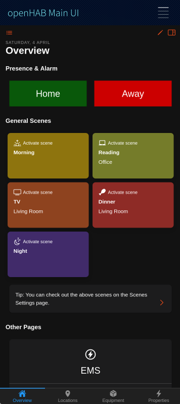
  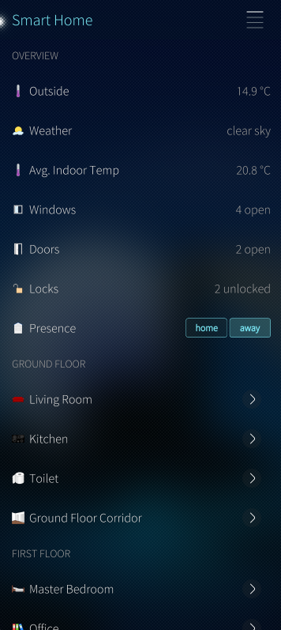
  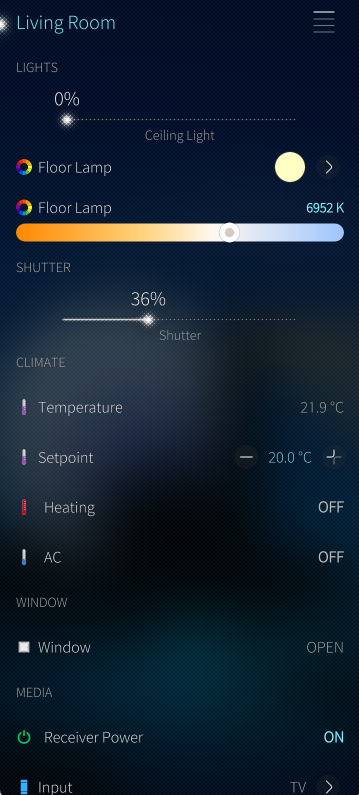

## App Configuration

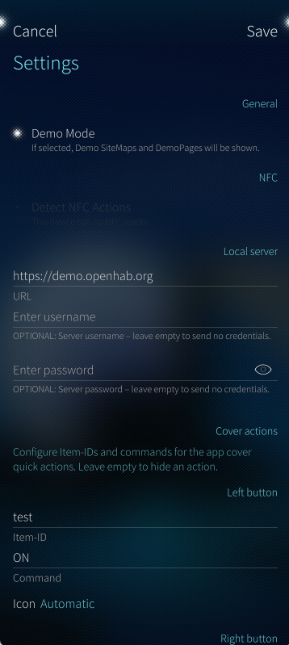

### Connection Settings

#### Demo Mode

This sets up the app to use the openHAB demo server and can be used to experience the app without needing to install openHAB.

Disable this to use the app with your own openHAB instance.

#### Local Server

- URL: This is the primary connection to your openHAB instance, a fully qualified URL with an IP address or hostname is required.

Example:
`http://192.168.0.10:8080`
`https://testdomain.com`

- Username: The username of your openHAB user (if authentication is enabled on your openHAB server).
- Password: The password of your openHAB user (if authentication is enabled on your openHAB server). Your password will be saved obfuscated on your device and is not shared with anyone.

### NFC

#### Detect NFC Actions

If enabled, the app reacts on openHAB NFC tags: Lay a tag on your phone and the stored command will be sent to your openHAB server (or the stored sitemap page will be opened).
This works while the app is running - also if the app is only shown as cover in the background.

Note: This option is disabled by default on purpose.
While it is enabled, every openHAB tag laid on your phone triggers its command.
If your device has no NFC reader, or NFC is switched off in the Sailfish OS system settings, the app shows a hint below the switch.
See [NFC Tags](#nfc-tags) for details.

### Cover Actions

Allows you to set custom App-Cover-Quick-Actions for the cover widget when you view all open applications.

  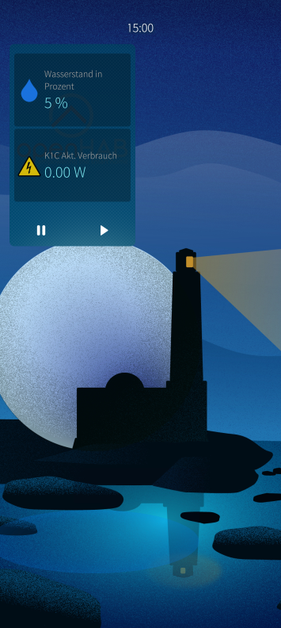
  
  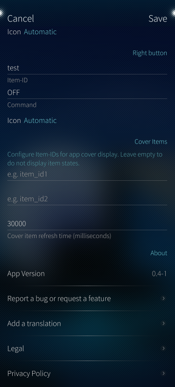

- Left button - Item-ID: The [Name](https://www.openhab.org/docs/configuration/items.html#name) (Item-ID -- **not** the label) of the item you want to send a command to when the left button is pressed.
- Left button - Command: The command (eg. ON, OFF, UP, DOWN) you want to send to the item when the left button is pressed.
- Right button - Item-ID: The [Name](https://www.openhab.org/docs/configuration/items.html#name) (Item-ID -- **not** the label) of the item you want to send a command to when the right button is pressed.
- Right button - Command: The command (eg. ON, OFF, UP, DOWN) you want to send to the item when the right button is pressed.
- Icon: The icon shown on the cover button (eg. On, Off, Stop, Timer, Favorite). Keep "Automatic" to let the app choose an icon based on the command.

Note: If you don't want to use App-Cover-Quick-Actions, please leave the fields empty.
You can also use one button only, just leave the other button configuration empty.
It will be deactivated if no Item-ID AND command is provided.
If a command could not be sent (eg. server not reachable), you will get a Sailfish OS notification with the reason.

### Cover Items

Allows you to set two items for app cover display. The state of these items will be displayed on the app cover when you view all open applications.

  
  
  

- Item-ID: The [Name](https://www.openhab.org/docs/configuration/items.html#name) (Item-ID -- **not** the label) of the item you want display on the app cover.
- Item-ID: The [Name](https://www.openhab.org/docs/configuration/items.html#name) (Item-ID -- **not** the label) of the item you want display on the app cover.
- Item-refresh-interval: The interval in milliseconds in which the app should refresh the state of the items for display on the cover.

Note: If you don't want to display item values on your app cover, please leave the fields empty.
You can also use one item only, just leave the other item configuration empty.

## Navigation, Main UI and Sitemap Usage

Tap the hamburger menu at the top right to open the menu and navigate to the Main UI, sitemaps, "Write NFC Tag" or settings.

  
  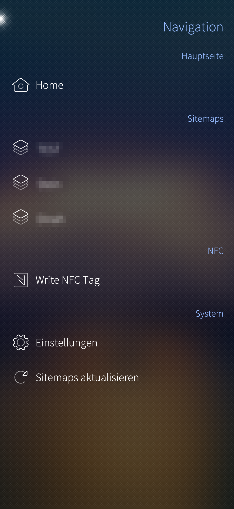

Pull-Up: Use the native [Pulley Menu](https://docs.sailfishos.org/Develop/Apps/UI/#gestures-for-navigation-and-actions) gesture:

- Scroll to top: Scrolls to the top of the current view.

Pull-Down: Use the native [Pulley Menu](https://docs.sailfishos.org/Develop/Apps/UI/#gestures-for-navigation-and-actions) gesture:

- Write this Sitemap to NFC Tag: Writes the currently shown sitemap page to an NFC tag (see [NFC Tags](#nfc-tags)).
- Refresh Sitemap: Will load current sitemap again and update all item states. Only needed if you change your sitemap structure on openHAB server and want to see the changes in the app without switching to another sitemap and back again.

Long press on an item: Opens the context menu of the item (Switch, Switches with Button-Mappings, Selections, Rollershutter, Setpoint, Input, Buttongrid):

- Write Command to NFC Tag: Writes a command of this item to an NFC tag (see [NFC Tags](#nfc-tags)).

## NFC Tags

With NFC tags you can trigger openHAB actions without opening the app: Lay the tag on your phone and the command will be sent to your openHAB server.
The app uses the same tag format as the openHAB Android app, so tags written with the Android app work with the Sailfish OS app and vice versa.

Requirements:

- Your device has an NFC reader and NFC is switched on in the Sailfish OS system settings.
- Demo Mode is disabled - tags pointing to the demo server would be worthless.
- For reading tags: [Detect NFC Actions](#detect-nfc-actions) is enabled in the settings.
- A supported tag (see [Supported tags](#supported-tags)).

### Supported tags

The app can only use tags which the Sailfish OS NFC daemon (nfcd) supports.

| Tag                                                         | Read | Write |
|-------------------------------------------------------------|------|-------|
| NFC Forum Type 2 (eg. NTAG213, NTAG215, NTAG216, Ultralight) | yes  | yes   |
| NFC Forum Type 4 (ISO-DEP, eg. DESFire with NDEF)           | yes  | no    |
| NFC Forum Type 5 (ISO 15693 / NFC-V, eg. ICODE SLIX)        | no   | no    |
| Type 1, Type 3 (FeliCa), MIFARE Classic                     | no   | no    |

Note: The openHAB Android app also supports Type 5 tags like ICODE SLIX.
These tags are not detected by Sailfish OS at all, so they cannot be used with the Sailfish OS app - neither tags written by the Android app.
If you want to use the same tags on Android and Sailfish OS, please use NTAG21x tags.

### Tag types

- Item command: Sends a command (eg. ON, OFF, UP, DOWN) to an item.
- Sitemap: Opens a sitemap or a sitemap subpage. The app will be brought to the foreground for this.

### Write an item command to a tag

There are two ways to write an item command to a tag:

- Navigation menu: Tap the hamburger menu and select "Write NFC Tag". By default, the items of your last opened sitemap are shown. Use the Pull-Down menu to switch to "Show all items" (every item on your openHAB server) and back, or to "Reload" the list. Use the search field to filter the items by name or label.
- Sitemap: Long press on an item in your sitemap and select "Write Command to NFC Tag".

  
  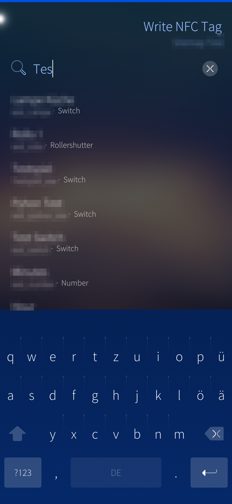
  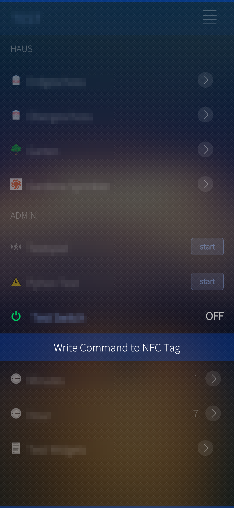

Afterwards choose the command you want to write.
The app offers the commands of the item (command options from openHAB, the Button-Mappings of the sitemap widget or the default commands of the item type).
For items like Number, String or Dimmer, you can also enter a value yourself.

Now hold the tag against the back of your phone until "Tag written." is shown.
If the label of the item does not fit on a small tag, the app automatically writes a shorter version without the label.

  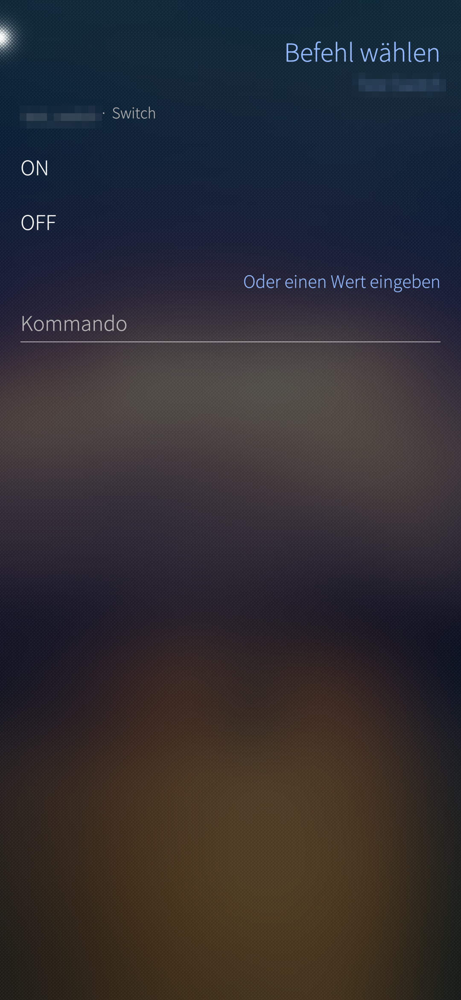
  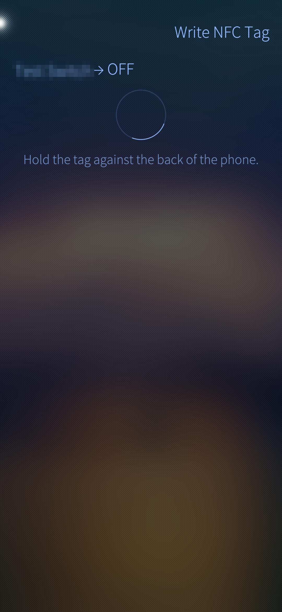

Note: Items which cannot receive commands (eg. Contact, Image) are not offered.

### Write a sitemap page to a tag

Open the sitemap (or subpage) you want to write, use the Pull-Down menu and select "Write this Sitemap to NFC Tag".
Hold the tag against the back of your phone until "Tag written." is shown.

### Messages while writing

- No tag was detected: No tag was laid on the phone within 30 seconds. Tap "Try again".
- This tag type cannot be written: The tag is not an NFC Forum Type 2 tag (see [Supported tags](#supported-tags)).
- The tag could not be read: Hold the tag still against the phone and try again.
- The tag is too small for this command: Even the short version does not fit on the tag. Use a tag with more memory (eg. NTAG215 instead of NTAG213).
- Writing failed. The tag may be write protected: The tag is locked and cannot be written anymore.
- The tag was removed too early: The tag was lifted while writing. Write it again, otherwise its content may be incomplete.

### Use a tag

Enable [Detect NFC Actions](#detect-nfc-actions) in the settings and lay the tag on your phone:

- Item command: The command will be sent to your openHAB server. You will get a notification with the item and the command - name and command label are taken from your openHAB server, not from the tag.
- Sitemap: The app comes to the foreground and opens the sitemap page. For a subpage, the sitemap itself is placed underneath, so "back" leads you to it.

Note: The app checks first if the item or sitemap exists on your openHAB server.
If not, or if the server is not reachable, you will get a notification with the reason.
A tag which is already lying on the phone when the app starts (or when you finish writing it) will not trigger - lift it and lay it on again.
The same tag will only be triggered once within 5 seconds.
While you are writing a tag ("Write NFC Tag" pages are open), reading tags is paused.

## Contributing to the project

We are happy about any contribution to the project, whether it's bug fixes, new features, translations or documentation.

Please check out our GitHub repository for more information on how to contribute.

## Trademark Disclaimer

Product names, logos, brands and other trademarks referred to within the openHAB website are the property of their respective trademark holders.
These trademark holders are not affiliated with openHAB or our website.
They do not sponsor or endorse our materials.

Sailfish OS and the Sailfish OS logo are trademarks of Jolla Group Ltd.
